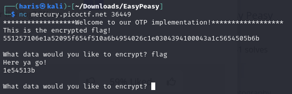
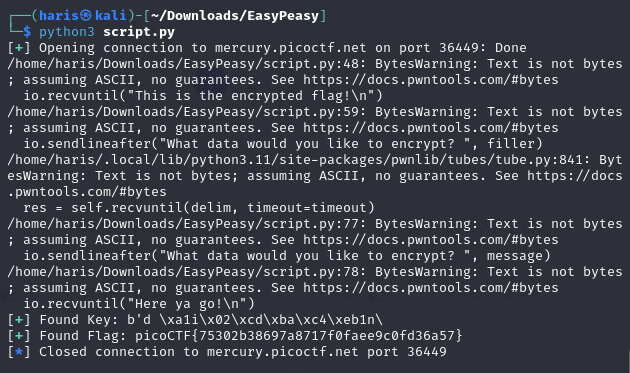

# Easy Peasy
### AUTHOR: MADSTACKS
### Challenge Points: 40

## Category
Cryptography

## Challenge Description
A one-time pad is unbreakable, but can you manage to recover the flag? (Wrap with picoCTF{}) nc mercury.picoctf.net 36449 [otp.py](otp.py)
## Hints
Maybe there's a way to make this a 2x pad.
## Solution
When we establish a connection to the service provided, we initially receive the flag in an encrypted form. Subsequently, we have the capability to encrypt an unlimited amount of data.

<br>



<br>

1. As indicated in the description, this challenge involves a one-time pad. One of the key principles of a one-time pad is that the key must never be reused, either in part or in full. However, we can modify the program so that it violates this principle.

2. The critical flaw in the otp.py script is found in lines 34-36:
```python
if stop >= KEY_LEN:
    stop = stop % KEY_LEN
key = kf[start:] + kf[:stop]
```
In this code snippet, `stop` is calculated as the sum of the previous ending point of the key and the length of the new user input. If `stop` exceeds the length of the key, it is reset to `stop % KEY_LEN`, effectively allowing the key to wrap around. Consequently, if the user input is just enough to reach the end of the keyfile, `stop` will be set to 0 (since `40000 % 40000` is 0). As a result, `key_location` will also be set to 0, causing the encrypt function to receive `key_location=0`. This allows us to reuse the same key used to encrypt the flag.

3. To create a pwntools template for this challenge, use the following command:
```
pwn template --host mercury.picoctf.net --port 36449 otp.py
```

4. The solve [script.py](script.py) is commented and explains the solution in detail. In essence, by knowing a clear text message and its corresponding encrypted message, we can determine the key (as described in this Computer Science StackExchange answer) and then decrypt the flag.

The Script:

[script.py](script.py)

Output:

<br>



<br>

## Flag
`picoCTF{75302b38697a8717f0faee9c0fd36a57}`