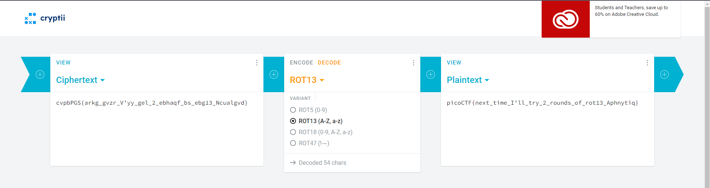

# Mod 26
### AUTHOR: PANDU
### Challenge Points: 10

## Category
Cryptography

## Challenge Description
Cryptography can be easy, do you know what ROT13 is? `cvpbPGS{arkg_gvzr_V'yy_gel_2_ebhaqf_bs_ebg13_Ncualgvd}`
## Hints
This can be solved online if you don't want to do it by hand!
## Solution
Use an online ROT13 converter like [cryptii.com](https://cryptii.com/pipes/rot13-decoder) and enter cvpbPGS{arkg_gvzr_V'yy_gel_2_ebhaqf_bs_ebg13_Ncualgvd}

 

 

## Flag
`picoCTF{next_time_I'll_try_2_rounds_of_rot13_Aphnytiq}`