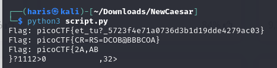

# New Caesar
### AUTHOR: MADSTACKS
### Challenge Points: 60

## Category
Cryptography

## Challenge Description
We found a brand new type of encryption, can you break the secret code? (Wrap with picoCTF{}) mlnklfnknljflfjljnjijjmmjkmljnjhmhjgjnjjjmmkjjmijhmkjhjpmkmkmljkjijnjpmhmjjgjj [new_caesar.py](new_caesar.py)
## Hints
1. How does the cipher work if the alphabet isn't 26 letters?
2. Even though the letters are split up, the same paradigms still apply
## Solution
1. Let's analyze [new_caesar.py](new_caesar.py) program in reverse.
2. Refer to the comments in the solution [script](script.py) for a thorough explanation. We reverse the encoding process, test various offsets, and display the potential flags.

 

 

## Flag
`picoCTF{et_tu?_5723f4e71a0736d3b1d19dde4279ac03}`